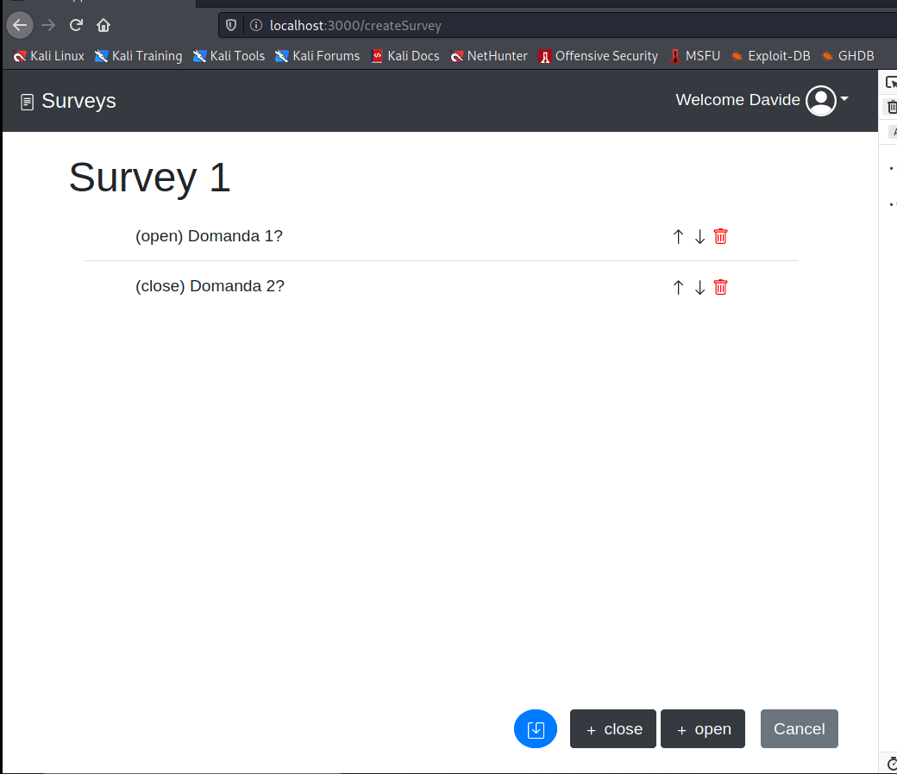

# Exam #1: "Questionario"
## Student: s292516 LEONE DAVIDE 

## React Client Application Routes

- Route `/`: reindirizza a '/listSurvey'
- Route `/login`: form login, serve per loggare utente

- Route `/listSurvey`: visualizza lista questionari

- Route `/listSurvey/createSurvey`: modal per inserire nome del nuovo questionario
- Route `/createSurvey`: contiene strumenti per creare un nuovo questionario
- Route `/createSurvey/addCloseQuestion`: form per inserire domanda chiusa
- Route `/createSurvey/addOpenQuestion`: form per inserire domanda aperta

- Route `/newSubmission/:id`: passa id questionario e visualizza form per inserire nome utente di chi lo vuole compilare
- Route `/answersSurvey/:id`: recupera info relative ad un questionario e permette di compilarlo

- Route `/listSurvey/showSurvey/:id/:submission`: recupera info relative ad una specifica compilazione e ne visualizza le risposte

## API Server

- POST `/api/sessions`

- GET `/api/sessions/current`

- DELETE `/api/sessions/current`

- GET `/api/surveys`
  - {id, title, questions[]}

- GET `/api/compileSurvey/:id`
  - {id, title, questions[{id, orderId, type, question, min, max, choices[{id, content}]}]}

- POST `/api/submissions`
  - const submission = {
    idSurvey: req.body.idSurvey,
    name: req.body.name,
    choices: [...req.body.choices], //{idQuestion, choices[]}
    };
  - lastId

- GET `/api/submissions/:id`
  - [{id, name, choices[{id, idQuestion, type, content}]}]

- POST `/api/surveys`
  - const survey = {
    title: req.body.title,
    user: req.user.id,
    questions: [...req.body.questions],
    choices: [req.body.choices]
    };

- GET `/api/surveysByUser`
  - {id, title, questions[], count}

- GET `/api/survey/:id`
  - {id, name, choices[{}] }

## Database Tables

- Table `amministratori` - contains id name email hash
- Table `surveys` - contains id title user
- Table `questions` - contains id idOrder idSurvey type content min max
- Table `options` - id idSurvey idQuestion content

- Table `submissions` - contains id idSurvey userName
- Table `openAnswers` - contains id idSubmission idQuestion content
- Table `choices` - contains id idSubmission idQuestion risp1,...,risp10

## Main React Components

- `ListSurvey` (in `ListSurvey.js`): carica i questionari dal db e li visualizza
- `NavBart` (in `NavBar.js`): reindirizza sulla lista dei questionari e permette di accedere al login ed al logout
- `LoginForm` (in `LoginComponents.js`): gestisce login e logout utente

- `CreateSurvey` (in `CreateSurvey.js`): mette a disposizione gli strumenti per creare un nuovo questionario
- `CreateSurveyModal` (in `CreateSurvey.js`): modal che prende il nome del nuovo questionario

- `CreateCloseQuestion` (in `CreateQuestion.js`): form per creare domande chiuse
- `CreateOpenQuestion` (in `CreateQuestion.js`): form per creare domande aperte

- `AnswerSurveyModal` (in `AnswerSurveyModal.js`): modal che prende il nome dell'utente che effettua una nuova compilazione
- `AnswerSurvey` (in `AnswerSurvey.js`): permette di compilare un questionario

- `ShowSurvey` (in `ShowSurvey.js`): visualizza le risposte relative ad un questionario

## Screenshot

## Users Credentials

- amministratore1@gmail.com, MAG2020 
- mario@gmail.com, qwerty 
